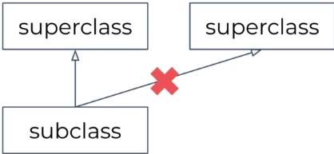

# 18강. Class, Interface

## 1. Class
- class 는 객체를 정의하는 방법이다.
~~~kotlin
// 기본형태
class Product constructor(val categoryLable : String) // constructor 가 1개만 있을경우 생략 가능
// constructor 생략 형태
class Product (val categoryLable : String) // constructor 생략
// 주 생성자와 부 생성자
class Product (val categoryLabel : String){
    // 부 생성자
    constructor(categoryLabel: String,name : String) : this(categoryLabel) // this 는 프로덕트를 가리킨다.
}
~~~
위와같이 주생성자, 부 생성자를 나뉘는 방식은 잘 쓰이지않는다. 이유는 아래와 같다.
~~~kotlin
class Product (val categoryLabel : String, val name: String = "")
// 생성자 파라미터에 디폴트값이 존재하는 파라미터는 필수값이 아니기 때문에 categoryLabel 만으로 프로덕트를 생성하는것이 가능하다
val product = Product("요렇게 인자 하나만 넣어도 가능")
~~~

- Class 의 최 상위 Class 는 Any Class 이다. (최 상의 superclass)
~~~kotlin
open class Any

open operator fun equals(other: Any?) : Boolean
open fun hashCode() : Int
open fun toString(): String
~~~
- ###상속 구조

~~~kotlin
// final 로 디폴트가 되어있기 때문에 open 키워드로 영어줘야 상속이 가능 하다.
final class Store {...}
~~~
>- class 는 open 키워드가 붙어야만 상속할 수 있다.
>- class 에 파라미터가 있다면 파라미터도 같이 상속해야한다.
>- 하나의 쿨레스만 상속 가능하다.
~~~kotlin
open class Base(p : Int)

class Derived(p : Int) : Base(p)
~~~

### 퍼로퍼티 : 데이터를 저장하는 field + 접근자 (getter/setter)
~~~java
public class Person {
    private final String name;
    private boolean isMarried;

    public Person(String name, boolean isMarried) {
        this.name = name;
        this.isMarried = isMarried;
    }

    public String getName() {
        return this.name;
    }

    public void setIsMarried(boolean isMarried) {
        this.isMarried = isMarried;
    }

    public boolean getIsMarried() {
        return this.isMarried;
    }
}
~~~

java 는 데이ㅓ를 field 에 저장한다. 그리고 getter/setter 메소드와 같은 **보일러플레이트** 코드가 지저분하게 많아진다.
- ❓ Boilerplate (code) : 코드 재사용성과 관련지어서 정의된다.(최소한의 변경으로 여로곳에서 재사용되며, 반복적으로 비슷한 형태를 띄는 코드를 지칭한다.)

위 Java 코드를 코틀린으로 표현하면 간단해 진다.
~~~kotlin
class Person(val name: String, var isMarried: Boolean)
~~~
위 코드와 완전 동일한 코드이다.
- ###❗ val 과 var
>- val 은 setter 은 제공하지 않음 (조회만 허용) // 불변
>- var 은 setter/getter 을 둘다 제공함 (조회 변경 허용) // 가변

~~~kotlin
class Person {
    val name: Int
        get() {
            return this.age
        }

    var isMarried: Boolean
        get() {
            return this.isMarried
        }
        set(isMarried: Boolean) {
            this.isMarried = isMarried
        }
}
~~~
위에서 get()과 set()을 정해준 것은 커스텀 접근자이다. 기본적으로는 코틀린 클래스를 만들 때 
생성자에 넣어준 데이터들에 대하여 get()과 set()이 숨겨져 있으나, 위의 코드처럼 명시적으로 적어줄 수 있다. 
그말은 getter와 setter를 커스텀 할 수도 있다는 뜻이다.

### 생성자에 val, var 유무의 차이
~~~kotlin
class Person(val name: String)

class Person(name: String)
~~~

- 생성자에 val(또는 var)이 있는 경우 멤버변수로 변환된다. 
즉 class Person(val name: String)의 경우 아래 자바 코드로 변환된다.

### 1) class Person(val name: String) 의 경우

~~~java
public final class Person {
   @NotNull
   private final String name;

   @NotNull
   public final String getName() {
      return this.name;
   }

   public Person(@NotNull String name) {
      Intrinsics.checkParameterIsNotNull(name, "name");
      super();
      this.name = name;
   }
}
~~~

### 2) class Person(name: String) 의 경우
~~~java
public final class Person {
   public Person(@NotNull String name) {
      Intrinsics.checkParameterIsNotNull(name, "name");
      super();
   }
}
~~~

- kotlin 의 경우 val 나 var 이 없는 경우에는 주 생성자의 파라미터들은 생성자( init {...} ) 또는 프로퍼티를 초기화 하는 식에서만 사용 가능하다.
따라서 클래스 생성자 외 다른 메서드에서는 사용할 수 없다.
  
~~~kotlin
class Person(name: String) {
    init {
        println(name)
    }
}
~~~
위 코드는 java 코드로 변환된다.
~~~java
public final class Person {
   public Person(@NotNull String name) {
      Intrinsics.checkParameterIsNotNull(name, "name");
      super();
      System.out.println(name);
   }
}
~~~

### 주의할점!
디컴파일한 java 코드에서 필드가 private 이라고 하여 kotlin 의 프로퍼티도 private 은 아니다. 
이게 무슨말인가 싶겠지만, 필드와 프로퍼티를 다르게 인식할 줄 알아야 한다.

java 는 기본적으로 필드로 다루고, kotlin 은 프로퍼티(필드 + 접근자)를 기본으로 다루는 언어다.

~~~kotlin
class Person(var name: String)
~~~
위 코드는 아래의 java 코드가 된다.
~~~java
public class Person {
    private String name;

    public Person(String name) {
        this.name = name;
    }

    public Void setName(String value) {
        this.name = value;
    }

    public String getName() {
        return this.name;
    }

}
~~~

java 필드인 name 자체만 보면 private 키워드가 붙어있으므로 private 이 맞지만, 프로퍼티 전체를 보면 다르다. 
필드는 private 이지만 getter 와 setter 로 접근이 모두 가능하기 때문에 프로퍼티는 private 하다고 볼 수 없다.
위의 코드에서 name 프로퍼티가 private 이기 위해서는 아래와 같은 코틀린 코드가 필요하다.

~~~kotlin
class Person(private var name: String)
~~~

name 앞에 private 이 붙었다. private 이 붙지 않은 상태였어도 디컴파일한 java 코드의 필드에는 private이 붙지만, 
kotlin 은 기본적으로 필드가 아닌 프로퍼티를 다루기 때문에 프로퍼티 전체가 private이 된다. 디컴파일된 java 코드는 아래와 같다.

~~~java
public final class Property {
   private String name;

   public Property(@NotNull String name) {
      Intrinsics.checkParameterIsNotNull(name, "name");
      super();
      this.name = name;
   }
}
~~~

getter 와 setter가 없어서 프로퍼티가 private 이라고 볼 수 있다.

>### 핵심
>java 는 필드를 기본으로, kotlin 은 프로퍼티를 기본으로 다룬다.
디컴파일된 java 코드의 필드가 private 이라고해서 kotlin 프로퍼티가 private 인 것은 아니다.

## 2. abstract class (추상 클래스)

### 추상클래스
- 인스턴스화불가
- open 없이 subclass가 상속 가능
~~~kotlin
abstract class Polygon {
    abstract fun draw()
}
~~~
- 추상 class 안에서는 abstract 함수 구현부 X
- 아래와 같이 subclass 에서 구현해야한다.
~~~kotlin
class Rectangle : Polygon() {
    override fun draw() {
        // draw the rectangle
    }
}
~~~
## 3. interface
~~~kotlin
interface MyInterface {
    // 프로퍼티 정의 가능
    val prop: Int // abstract 
    // 상태저장 X
    // val property : String = "property"

    // 프로퍼티의 접근자 제공
    val propertyWithImplements: String
        get() = "food"

    // 본문이 있는 함수도 정의 가능
    fun food() {
        print(prop)
    }
    fun start() // abstract
}

// 인터페이스 구현 상속은 갯수 제한 X
class Child : MyInterface {
    override val prop: Int
        get() = TODO("Not yet implemented")
    
    override fun start() {
        TODO("Not yet implemented")
    }
}
~~~
    
    
