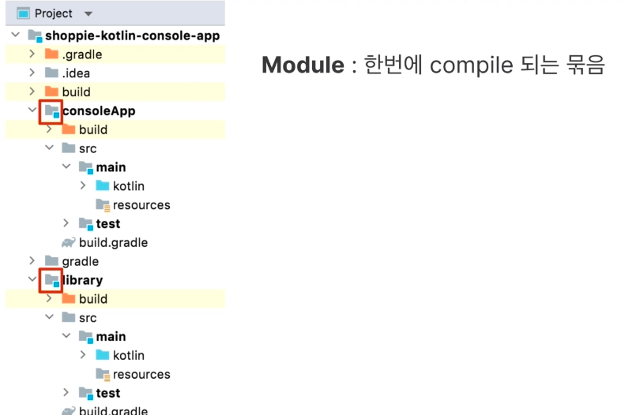

# 22강 복습

### 객체와 클래스
- 프로스래밍 관점 객체 : 식별자, 상태, 행동
- 클랴스 : 객체의 정의
- 인스턴스 : 클래스로 만든 객체
- 클래스 간 계층구조 형성 : 상속, interface
- Any : 클래스 계층구조의 최상위 클래스
- data class : 데이터를 담는 용도의 클래스

### 함수
- 특정 동작을 수행하는 묶음
- 선언 방식 : 중괄호, single expression
- 배치 위치 : top-level / 클래스 멤버

### Overriding
- superclass, subclass
  - 상속계층이 생성되면, superclass, subclass 의 실행 순서, 호출순서를 알아야한다.
  - subclass 는 superclass 의 함수 및 프로퍼티를 재정의(Overriding)할 수 있다.

### 가시성 변경자
- 클래스, 변수, 함수를 외부에 노출하는 범위 결정
  
  - 패키지 개념

  
  - 모듈 개념

- top-level : public, private(file 내부에서만 접근 가능), internal(같은 모듈 내에서만)
- 클래스 멤버  public, private, internal, protected(private 와 동일, subclass 에서는 참조 가능)