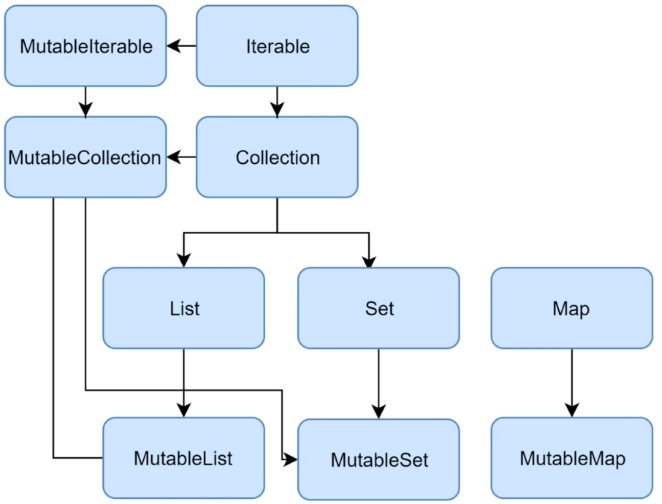

# 25강 - 단일 객체 생성 & 입력 요청 공통화
- collections, object, Extension functions, Scope functions

## Collection 의 interface 의 관계

1, List (순서를 가진 컬렉션)
- ordered collection
- index 로 원소에 접근 가능
listOf(1, 2, 2) // [1, 2, 2]
  
2. Set (순서 X, 원소는 중복 X)
- unique elements
setOf(1, 2, 2) // [1, 2]
  
3. Map
- key-value pairs
mapOf("first" to 1, "second" to 2, "second" to 3) // {first = 1, second = 3} 
  
Type
- list, set, Map 은 Immutable Type 이기 떄문에 생성한 값을 이후에 생성할 수 없다.
(1) read - only
~~~kotlin
val numbers = listOf("one", "two", "three", "four")
val numbersIterator = numbers.iterator()
while (numbersIterator.hasNext()){
    println(numbersInterator.next())
}

// 결과
/*
one
two
three
four
 */
~~~